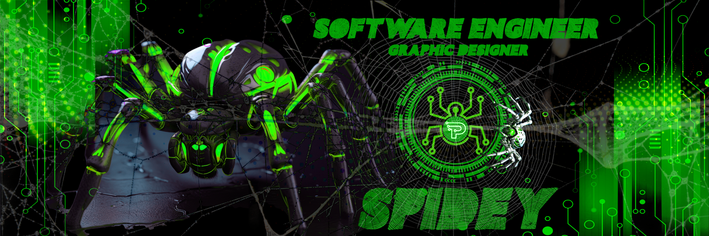

## Hi there,  I'm [Mr Peter Kibet!](https://Peter-Kibet.me/)  

I am a graduate 🎓 with a strong background in computer science 💻 and experience in exploratory data analysis, machine learning, computer vision, and statistics 🔥. Currently, I am working as a **Software Engineer Fellow** at [**Headstarter AI**](http://headstarter.com/) 🚀. My research interests include Computer Vision, Geometric Machine Learning, Group Theory, and Manifold Learning ✨. As I am passionate about learning new topics in data science, visualizing data, and conducting research 🤓, I enjoy sharing valuable insights 🧐 and making an impact that helps others learn. I am always open to discussions, so feel free to ask questions or share concerns 💬.

   

 

## ⚡ A Few Quick Facts:

- 🔭 **Current Work:** Engaged in multiple projects focused on Computer Vision.
- 🧮 **Learning:** Enhancing skills in Python and initiating a startup called Cooky Chef.
- 👯 **Collaboration:** Open to collaborating on research projects related to Computer Vision.
- 🤔 **Seeking Assistance:** Looking for expertise in Group Theory and Manifold.
- 💬 **Ask Me About:** Anything related to the latest technology trends.
- 📫 **Contact:** Reach me via [email](mailto:peterkibet@spideyinc.com).
- 😄 **Pronouns:** He/Him
- 🧾 **Resume:** View my [resume](https://docs.google.com/document/d/1NIJmHwj6KTvTC9N_5BUy-HQyiT_M8gj6/edit?usp=sharing&ouid=117793958848832542855&rtpof=true&sd=true).
- 📝 **Blog:** Read my articles on [Medium](https://medium.com/@peterjamesonsmontana).

## 🛠️ Languages and Tools I use:

  
  
  
  
  
  
  
  
  
  
  
  
  
  
  
  
  
          
  
  
  
  
  
  
  
  
  
  

  
  
  
  
  
  
  
  
  
  
  
  
  
  
  
  
  
  
  
  
          
  
  
  

  
  
  

  
  
      
  
  
  
  

  
  
  

 

## 🏆 GitHub Trophies:

    

 

## 📈 GitHub Contribution Graph:

    

 

## 📊 GitHub Stats:

 
 

## 🕑 Wakatime Stats:

<!--START_SECTION:waka-->
<!--END_SECTION:waka-->

  

