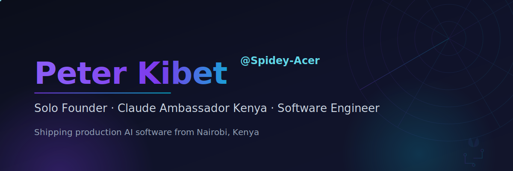

<!-- ═══════════════════════════ HERO BANNER ═══════════════════════════ -->

  

<!-- ═══════════════════════════ ANIMATED TAGLINE ═══════════════════════════ -->

  

<!-- ═══════════════════════════ SOCIAL BADGES ═══════════════════════════ -->

---

## 👋 Who I am

<table>
<tr>
<td width="230" valign="top" align="center">
  
   
  <b>Peter Kibet</b> · Nairobi 🇰🇪
</td>
<td valign="top">

I'm the **Founder & CEO of [Spidey Labs Limited](https://spideylabs.tech)** — a registered Kenyan software company building production AI systems for African businesses. Based in **Nairobi, Kenya**, I've shipped **50+ projects** and I care about one thing: **software that ships and stays running.**

- 🏢 **Founder & CEO** of **[Spidey Labs Limited](https://spideylabs.tech)** — a registered Kenyan software company.
- 🌱 Building **[MkulimaOS](https://github.com/Spidey-Acer/mkulimaos)** — enterprise farm-management SaaS, **live on real Kenyan farms**, going head-to-head with decade-old global agritech.
- 🧠 **Anthropic Claude Ambassador — Kenya**, growing one of East Africa's first Claude developer communities at [**claudekenya.org**](https://claudekenya.org).
- 🎓 **MSc Computer Science (Cloud & AI)** candidate — University of East London.
- 🌾 A **farmer** at heart — which is exactly why farm-tech that *actually works* matters to me.

> *My rule is simple: don't just plan it — **ship it.***

</td>
</tr>
</table>

---

## 🚀 What I'm building

<table>
<tr>
<td width="50%" valign="top">

### 🌱 [MkulimaOS](https://github.com/Spidey-Acer/mkulimaos)
Multi-tenant farm-management SaaS — HR, inventory, operations, and analytics for African farms. **Live in production** at `app.mulinga.farm`.
  
`NestJS` · `Next.js` · `PostgreSQL` · `Prisma`

</td>
<td width="50%" valign="top">

### 🩺 [Verify](https://github.com/Spidey-Acer/verify)
Free public verification of health practitioners & facilities in Kenya. Multi-connector hub across regulatory bodies (PPB, KMPDC, NCK…).
  
`TypeScript` · `Next.js` · `Multi-source connectors`

</td>
</tr>
<tr>
<td width="50%" valign="top">

### 🇰🇪 [Claude Community Kenya](https://github.com/Spidey-Acer/Claude-Community-Kenya)
Official site for East Africa's first Claude developer community. `claudekenya.org`.
  
`Next.js` · `TypeScript` · `Tailwind`

</td>
<td width="50%" valign="top">

### 🤖 [Idea Validator](https://github.com/Spidey-Acer/idea-validator)
A committee of five Claude agents — VC, CTO, customer, coach & chair — stress-test your idea live with SSE streaming. One-command Vercel deploy.
  
`TypeScript` · `Claude API` · `SSE`

</td>
</tr>
</table>

  Also shipping across <b>ML &amp; security</b> — <a href="https://github.com/Spidey-Acer/pest-detection-and-crop-analysis-">crop-disease detection</a> · <a href="https://github.com/Spidey-Acer/Malware-Detection-System">malware detection</a> · <a href="https://github.com/Spidey-Acer/ADAS-Low-Visibility-Hazard-Detection">ADAS hazard detection</a> · <a href="https://github.com/Spidey-Acer/cyber-security-analysis-portfolio">cybersecurity portfolio</a>

<a href="https://github.com/Spidey-Acer?tab=repositories"><b>→ Browse all 75 repositories</b></a>

---

## 🛠️ Tech I ship with

---

## 📊 By the numbers

  
  

  

<!-- Contribution graph — profile summary card (GitHub-green contribution bars) -->

  

  

---

## 🧠 Beyond the code

- 🎤 I run **Claude Community Kenya** — talks, hackathons, and getting African developers building with AI.
- ♟️ I coach **chess for kids** (Chess Totos) and lead **Debugging Disciples**, a developer-faith community.
- ✍️ I write about founding, shipping, and AI on [**Medium**](https://medium.com/@peterjamesonsmontana) and [**peterkibet.co.ke**](https://www.peterkibet.co.ke).
- 🌍 I care about **African-built software solving African problems** — starting with agriculture and healthcare.

---

### 💬 Let's build something real

I'm open to **collaboration, founding-team conversations, and select client work.**
If you're shipping something that matters — or need someone who does — **reach out.**

 

*"Technology is the canvas, code is the brush — but shipping is the masterpiece."*

**Thanks for stopping by. Now go build something. 🕷️**

